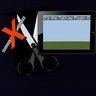

                                        
# BetterRaw

A simple plugin that add raw commands                         
WIP ;)
<a href="https://forums.pocketmine.net/plugins/betterraw.1715/">Download it on pocketmine :)</a>
###• Commands :
       - /tellraw <player> <message...>
       - /tellworldraw <world> <message...> 
       - /tip <player> <message...>
       - /tipworld <world> <message...>
       - /popup <player> <message...>
       - /popupworld <world> <message...>
####Tellraw
Tell a player a raw message.
Exemple > If you type "/tellraw Steve Hi, I'm using tellraw :)"                        
That will display on his chat :                       
Hi, I'm using tellraw :)                                     
####TellWorldRaw
Tell to every player in specific world a raw message                           
  Exemple > If you type "/tellworldraw world Hi, I'm using tellworldraw :)"                    
  That will display in the chat of every players in world "world" :                         
  Hi, I'm using tellworldraw :)
####Tip
Send a tip to a Player. Tip is like popups in PC ;)
Exemple > If you type "/tip Steve Hi, I'm using tip :)"                        
That will display on the middle of his screen :                       
Hi, I'm using tip :)                                     
####TipWorld
Send a tip to everyone in a specific world                      
  Exemple > If you type "/tipworld world Hi, I'm using tipworld :)"                    
  That will display in the middle of every players screen in world "world" :                         
  Hi, I'm using tipworld :)
####Popup
Send a popup to a Player. Popup are at the place you see the item name when switching items ;)
Exemple > If you type "/popup Steve Hi, I'm using popup :)"                        
That will display a litle bit higher than his inventory :                       
Hi, I'm using popup :)                                     
####PopupWorld
Send a popup to everyone in a specific world                      
  Exemple > If you type "/popupworld world Hi, I'm using popupworld :)"                    
  That will display in the a litle bit higher than everyone inventory in world "world" :                         
  Hi, I'm using popupworld :)
#•To do
– Adding a custom message for the sender                                              
– Adding everyone tellraw                                              
                               
